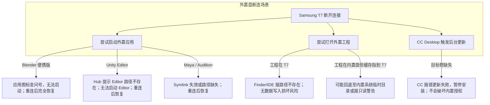

# 大型创作与工程应用外置拓扑调研报告：Unity / Blender / Substance / Adobe 在 256GB Mac 与 Samsung T7 上的分层放置边界

**票据关联**：[Issue #11](https://github.com/carllx/mac-cleanup/issues/11) (Part of [Wayfinder Map #1](https://github.com/carllx/mac-cleanup/issues/1))  
**研究日期**：2026-09-04  
**目标硬件基线**：Apple Silicon M1, 8GB 统一内存, 256GB 级内置 SSD（实际挂载 APFS 容器可用空间约 3.0GiB，处于临界极低余量），配备 Samsung T7 2TB 外置移动 SSD（挂载路径 `<T7>`，文件系统 `exfat`，已用 1.2TiB，可用约 585GiB）。  
**关联票据**：为 [Issue #6 Storage Tiering](https://github.com/carllx/mac-cleanup/issues/6) 提供关于大型 GUI 应用、引擎版本与素材管线的输入分层标准。

---

## 1. 执行摘要（Executive Summary）

针对 256GB 内置 SSD 极度紧缺与 Samsung T7 2TB 外置扩展的现实约束，本报告对 **Unity**、**Blender**、**Adobe Creative Cloud / Substance 3D** 以及本机其他大型 GUI 应用进行了系统的**只读事实探测（Read-only Fact Probe）**与**官方一手文档权威交叉核验**。

核心结论总结如下：

1. **五层解耦模型是应用外置决策的前提**：
   切忌以笼统的“该应用能不能装到外置盘”做二元判断，必须将应用解耦为 5 个独立层次：
   - ① **Application Binary (.app)**（主程序包）
   - ② **Launcher / Updater / License Service**（启动器、自动更新进程、授权/守护进程）
   - ③ **System & User State Library (`~/Library`, `/Library`)**（配置、登录凭证、系统级插件、App Support、Preferences、Caches）
   - ④ **Asset Libraries / Shelves / Packages / SDK Modules**（材质球、笔刷、引擎扩展模块、UPM 包缓存、Bifrost/Arnold 资产）
   - ⑤ **Project Files / Autosave / Scratch Disk / Render & Simulation Cache**（项目源文件、自动保存、暂存盘、烘焙与模拟缓存）

2. **核心目标应用外置能力定性**：
   - **Unity**：
     - **Unity Editor 核心与 PlaybackEngines (27GB+)**：**Safe / Recommended on T7**。官方原生支持在 Unity Hub 中配置 Installs Location 到外置盘，实测当前 `<T7>` 上已安装 `2022.3.54f1`（含 AndroidPlayer），已完成本地 CLI version 及 batchmode probe 验证。
     - **Unity Hub (`com.unity3d.unityhub`)**：**Keep on Internal SSD**。负责全局授权、Editor 探测与版本编排，体积仅约百兆，且依赖系统级 Helper。
     - **Unity UPM 缓存与 Asset Store 缓存**：**Supported but Conditional**。支持通过环境变量（`UPM_CACHE_ROOT`）或 `.upmconfig.toml` 重定向至 `<T7>`，但断连时在无网或未预取包环境下会导致项目编译解析挂起。
     - **Unity Projects**：**Safe / Recommended on T7**。实测当前用户约 15GB Unity 项目已安放在 `<T7>`。
   - **Blender**：
     - **Blender.app (802MB)**：**Safe / Recommended on T7**。macOS 版 Blender 为自包含单 App 包，支持跨卷存放；官方原生支持 **Portable Installation**（在 `Blender.app/Contents/Resources/` 下创建 `portable` 目录，配置、启动文件、已安装插件与扩展将随该目录保存）。注意：缓存与临时目录仍需结合内置 Preferences 显式配置。
     - **Blender User Library (`~/Library/Application Support/Blender`)**：目前占用仅 564KB；建议通过 Blender 原生“Preferences -> File Paths”将 Asset Libraries 与 Temporary Directory 显式指定到 `<T7>`。
   - **Adobe Creative Cloud & Substance 3D**：
     - **Creative Cloud Desktop & Core Services (CCXProcess / SLCache / SLStore / PCD)**：**Keep on Internal SSD**。官方明确 CC 桌面程序必须安装在默认的启动盘位置，不支持选择其他文件夹或驱动器；严禁外置或创建根级别 symlink，否则极易引发授权损坏与后台死锁。
     - **Substance 3D Painter / Designer .app**：**Needs runtime probe before external install**。虽然 CC Desktop 偏好设置中存在“Install location”，但 Adobe 官方故障排查（如 Error 179）明确要求安装路径必须在本地内置硬盘（local hard drive），**不得指定为外置驱动器（not an external drive）**。目前官方证据无法证明 macOS 下外置盘安装受官方支持，在没有严格运行时验证前，不得贸然安装到 `<T7>`。
     - **Substance 3D 资产架 (Shelf / Assets)**：**Safe / Recommended on T7**。官方设置中原生提供 `Edit -> Settings -> Libraries`（添加外置自定义资产库路径），此部分是空间占用的关键大头。
     - **Substance 3D 临时文件与 SVT 纹理缓存 (Temp / SVT Cache)**：**Safe / Recommended on T7**。官方支持在 `General Preferences -> Temporary files`（或环境变量 `SUBSTANCE_PAINTER_TEMP_LOCATION`）中显式重定向。
     - **Substance 3D 自动保存 (Autosave)**：**Safe / Recommended on T7**。官方插件中提供 `Plugins -> Autosave -> Configure`，可重定向到 `<T7>`。
   - **既有外置实践的客观审视（Autodesk Maya & Adobe Audition）**：
     - **Autodesk Maya 2024**：本机探测证实位于 `<T7>` 的 Maya 2024 目录（11GB）其可执行二进制执行 probe（`-v`）成功返回版本号；但这仅证明当前二进制具备执行能力，未经长周期运行时探测前，不泛化为其可长期无故障稳定运行。
     - **Adobe Audition 2024**：历史运维中曾对 `/Applications/Adobe Audition 2024` 创建指向 `<T7>` 的软链接（Symlink），且其缓存位于 `<T7>/AuditionCache`。软链接的存在属于历史遗留现状，不能作为证明当前 Adobe 更新及授权生命周期安全的证据，该模式归入 **Needs runtime probe before move**，绝不作为推荐外置模式。

3. **关键物理约束：Samsung T7 采用 `exfat` 文件系统**：
   - 探测证实当前 `<T7>` 为 **exFAT** 文件系统（挂载选项：`local, nodev, nosuid, noowners, noatime, fskit`）。
   - **exFAT 限制与兼容风险**：不支持 POSIX 文件所有权与细粒度权限（固定为 `noowners`）、不支持 UNIX 硬链接（Hardlink）、不支持原生扩展属性（会生成 `._` 双分叉文件）。对依赖严格 POSIX 权限或特定符号链接的工具构成潜在兼容风险。关于是否引入 APFS 稀疏磁盘映像（Sparse Image）等解决方案属于待研架构选项，交由后续票据（Issue #4 / #6）独立评估与验证。

---

## 2. 本机只读事实探测清单（Fact Probe Audit）

> **隐私与安全保护原则**：所有私人文件路径、个人项目名称与详细凭据清单仅在本地只读审计，公开报告全部采用 `<T7>`、`<BlenderProject>` 等中性别名去标识化。

### 2.1 存储与挂载现状
- **内置系统盘**：`/System/Volumes/Data`，容量 228GiB，已用 200GiB，**剩余可用空间仅约 3.0GiB（99% 占用）**，系统处于严重临界缺盘状态，日常操作存在由于 swap 或解压导致磁盘耗尽的风险。
- **外置盘 Samsung T7**：挂载于 `<T7>`，容量 1.8TiB，已用 1.2TiB，**可用 585GiB（69% 占用）**。文件系统类型为 `exfat`（挂载选项：`local, nodev, nosuid, noowners, noatime, fskit`）。

### 2.2 本机关键创作应用分布现状
| 应用/组件 | 探测位置 | 实际体积 | 类型/状态与探针证据 |
| :--- | :--- | :--- | :--- |
| **Unity 2022.3.54f1** | `<T7>/Applications/2022.3.54f1/` | **27 GiB** | 位于 `<T7>`。包含 `Unity.app` (13GB) 与 `PlaybackEngines/AndroidPlayer` (14GB)。CLI batchmode/version probe 通过 (`2022.3.54f1`)。 |
| **Unity Hub** | 无独立 `/Applications/Unity Hub.app` | 探测到更新缓存残留 | 遗留 Updater 缓存与配置。 |
| **Unity Projects** | `<T7>/PROJECTS/Unity/` | **15 GiB** | 位于 `<T7>`，包含项目工程及下载目录。 |
| **Blender** | `/Applications/Blender.app` | **802 MiB** | 位于内置盘。版本：`Blender 4.5.1 LTS`。CLI probe 验证通过。 |
| **Blender Support**| `~/Library/Application Support/Blender/` | 564 KiB | 包含 4.2 和 4.5 版本配置目录。 |
| **Blender Project**| `<T7>/PROJECTS/<BlenderProject>` | 198 MiB | 位于 `<T7>`。 |
| **Adobe Audition 2024** | `/Applications/Adobe Audition 2024` | 0 B (软链接) -> **3.3 GiB on `<T7>`** | 历史遗留软链接指向 `<T7>/Applications/Adobe Audition 2024`。归入待运行时验证，不作为推荐范式。 |
| **Audition Cache** | `<T7>/AuditionCache/` | 768 KiB | 历史已配置在外置 `<T7>`。 |
| **Autodesk Maya 2024** | `<T7>/Applications/Autodesk/` | **11 GiB** | 位于 `<T7>`。CLI binary probe 验证成功 (`Maya 2024, Cut Number 202302170737`)。仅证明当前二进制可执行。 |
| **Adobe Premiere Pro 2024** | `/Applications/Adobe Premiere Pro 2024` | 72 KiB | 内置盘仅保留卸载存根。 |
| **Substance 3D (历史痕迹)** | `~/Documents/Adobe/Adobe Substance 3D Painter/` | 328 KiB | 探测到历史文档目录、`shelf.ini`、assets/plugins 结构。当前未安装主程序。 |
| **Adobe 系统支持库** | `/Library/Application Support/Adobe/` | **1.7 GiB** | 包含 SLCache, SLStore, PCD, Adobe Desktop Common 等核心授权/基础设施。 |
| **Adobe 用户支持库** | `~/Library/Application Support/Adobe/` | **1.0 GiB** | 包含各类 CCXProcess、Dunamis、同步配置。 |

### 2.3 本机其他典型巨型 GUI 应用与支持库（内置盘主要压力源）
- **高占用 GUI 应用 (.app)**：
  - 办公三件套合计 **7.4 GiB** (Word 2.7G, Excel 2.5G, PowerPoint 2.2G)。
  - 企业微信 (`1.5G`)、WeChat (`1.4G`)、Google Chrome (`1.4G`)、calibre (`1.0G`)、Doubao (`1.0G`)。
- **高占用 `~/Library/Application Support` 目录**：
  - `Google`：**9.0 GiB**
  - `Quark`：**2.9 GiB**
  - `Antigravity`：**2.2 GiB**
  - `Doubao`：**1.9 GiB**
  - `Code` (VS Code)：**1.8 GiB**
  - `com.baidu.BaiduNetdisk-mac`：**1.2 GiB**

---

## 3. 官方技术规范与外置支持边界（Official Specifications & Technical Boundaries）

### 3.1 Unity：Hub、Editor、Modules、Cache 与 Projects

| 组件层次 | 官方机制与技术路径 | 放置可行性评级 | 空间归属与关键考量 |
| :--- | :--- | :--- | :--- |
| **Unity Hub (.app)** | 默认安装于 `/Applications/Unity Hub.app`。负责登录态、许可证管理、守护进程。 | **Keep on Internal SSD** | 主程序空间 (~200MB)。不建议外置，避免外置盘脱开后授权异常与协议失效。 |
| **Unity Editor (版本化核心)** | 官方在 Unity Hub **Preferences -> Installs -> Installs location** 中原生支持指定外部目录。 | **Safe / Recommended on T7** | 主程序空间。本机已成功部署并通过 CLI probe (`2022.3.54f1`)。 |
| **PlaybackEngines (平台模块)** | 随 Editor 一起安装在 Editor 同级目录下的 `PlaybackEngines`（如 AndroidPlayer、iOSSupport）。 | **Safe / Recommended on T7** | 模块/SDK 空间 (本机 AndroidPlayer 达 14GB)。必须随 Editor 主程序放置在同一卷内。 |
| **UPM 全局缓存 (Package Manager)** | 官方支持环境变量 `UPM_CACHE_ROOT`，或在用户主目录通过 `.upmconfig.toml` 配置 `cacheRoot`；Editor UI 也提供 Cache Location 修改。 | **Supported but Conditional** | cache 空间。**条件**：若 `<T7>` 断开，离线打开新项目且本地无依赖时会报错。 |
| **Asset Store 下载缓存** | 默认位于 `~/Library/Unity/Asset Store-5.x`。官方无 GUI 直接改路径。 | **Supported but Conditional** | 资源库空间。可作为离线包归档至 `<T7>`。 |
| **Unity Projects** | 创建与打开项目时，路径完全由用户自由指定。 | **Safe / Recommended on T7** | 项目数据空间。**极力推荐放在 `<T7>`**。 |
| **安装时暂存盘 (Temp Staging)** | **官方机制**：Unity Hub 下载解压安装包时，默认使用系统临时目录 (`$TMPDIR`)。 | **Keep on Internal SSD (Staging)** | temp 空间。**重要约束**：即使 Editor 目标指向 `<T7>`，下载解压仍需消耗内置盘临时空间。 |

### 3.2 Blender：自包含便携架构与外置边界

| 组件层次 | 官方机制与技术路径 | 放置可行性评级 | 空间归属与关键考量 |
| :--- | :--- | :--- | :--- |
| **Blender.app (主程序)** | macOS 原生 .app 包，自包含 Python 运行环境与核心共享库，支持直接在外部卷启动。 | **Safe / Recommended on T7** | 主程序空间 (~800MB)。可直接置于 `<T7>`。 |
| **Portable Mode (便携目录)** | 官方特性：在 `Blender.app/Contents/Resources/` 下创建名为 `portable` 的目录，Blender 会将 preferences、startup 文件、installed extensions 与 presets 保存在该目录下。 | **Safe / Recommended on T7** | 模块/配置空间。使扩展与用户首选项随应用便携移动。 |
| **Asset Libraries (资产架与笔刷)** | 官方支持在 **Preferences -> File Paths -> Asset Libraries** 中添加自定义外部卷目录。 | **Safe / Recommended on T7** | 资源库空间。完全支持保存在 `<T7>`。 |
| **Temporary Files & Autosave** | 官方支持在 **Preferences -> File Paths -> Temporary Files** 中重定向临时目录与自动保存路径。 | **Safe / Recommended on T7** | temp/autosave 空间。应结合配置显式指向外置目录。 |
| **Render Output & Cache** | 渲染输出在 Output 属性中逐工程定义；模拟与流体烘焙在工程所在目录或指定路径。 | **Safe / Recommended on T7** | render cache / 项目数据空间。随项目直接保存在 `<T7>`。 |

### 3.3 Adobe Creative Cloud & Substance 3D

| 组件层次 | 官方机制与技术路径 | 放置可行性评级 | 空间归属与关键考量 |
| :--- | :--- | :--- | :--- |
| **Creative Cloud Desktop & Daemons** | 包含 `Adobe Desktop Common`、`CCXProcess`、`Adobe Application Manager` 等系统级守护进程与核心服务。 | **Keep on Internal SSD** | 主程序/授权空间 (~2GB)。**官方明确指出 CC 桌面应用始终安装在默认位置，无法选择其他文件夹或驱动器**。外置将破坏授权与更新服务。 |
| **Substance 3D Painter / Designer .app** | Adobe CC Desktop 偏好设置提供 Install location，但 Adobe 官方故障排查（Error 179）明确强调**安装路径必须在本地内置硬盘，不支持外置驱动器（not an external drive）**。 | **Needs runtime probe before external install** | 主程序空间 (~3GB)。当前官方文档证据不支持外置安装，在未经严格运行时验证前，不得安装至 `<T7>`。 |
| **Painter 个人资源库 (Assets / Shelves)** | 官方在应用内提供 **Edit -> Settings -> Libraries**，支持点击 “+” 添加自定义外置路径。 | **Safe / Recommended on T7** | 资源库空间 (材质、贴图、笔刷)。**推荐配置至 `<T7>`**。 |
| **Sparse Virtual Texture (SVT) & Temp Cache** | 纹理虚拟化缓存与暂存盘。官方支持在 **General Preferences -> Temporary files** 修改，或使用环境变量 `SUBSTANCE_PAINTER_TEMP_LOCATION`。 | **Safe / Recommended on T7** | cache/temp 空间。高分辨率贴图烘焙极占空间，推荐外置至 `<T7>`。 |
| **Autosave 备份** | 官方内置插件：在 **Plugins -> Autosave -> Configure** 中，可开启 "Always save in the following directory" 并指定外置路径。 | **Safe / Recommended on T7** | autosave 空间。防止未命名工程保存到 `~/Documents` 占用内置盘。 |
| **安装与更新时的 Temp 缓冲** | **官方机制**：CC Desktop 下载应用与更新差分包时会先写入系统启动盘临时缓存，完成后再落地。 | **Keep on Internal SSD (Staging)** | temp 空间。**当前内置盘仅约 3GiB 空闲，处于极度临界状态，在可用空间未恢复前切勿尝试安装或更新大型应用**。 |

---

## 4. 断连与异常场景风险评估（Disconnection & Fault Matrix）

由于 Samsung T7 为 USB 外置驱动器（且格式化为 exFAT），必须对物理断连等场景建立风险矩阵：



### 详细风险项分析：
1. **启动风险（Startup Risk）**：
   - *表现*：当 `<T7>` 断连时，外置应用会出现问号或提示“未能找到原身”。
   - *判定*：**无永久性损坏**。重新插上 `<T7>` 挂载后，应用即可恢复。
2. **授权与许可证风险（License Continuity Risk）**：
   - *表现*：Unity 与 Adobe 的许可证核心（SLCache / SLStore / PCD / ULF）均位于内置盘。
   - *判定*：**安全**。授权服务保留在内置盘，重连 `<T7>` 后不需要重新激活或重新登录。
3. **静默回退与“幽灵膨胀”风险（Fallback Phantom Risk）**：
   - *表现*：若 Cache/Temp 路径硬编码为 `/Volumes/...`，当 `<T7>` 未挂载时，部分程序可能在 `/Volumes` 下自动创建普通目录并将缓存写入内置盘启动卷。
   - *防范原则*：所有重定向需在挂载点确认存活时方可生效。
4. **数据与工程连续性风险（Project Data Integrity）**：
   - *表现*：创作过程中若 `<T7>` 意外拔出，写盘或自动保存会失败。
   - *防范原则*：在 Blender / Painter 中合理配置保存版本与备份周期。

---

## 5. 综合决策与分类拓扑表（Application Placement Topology）

基于上述调研与本机事实探测，建立全系统组件的四级权威分类清单：

| 决策分类 | 涵盖组件与具体路径 | 空间类型 | 空间释放/规避估算 | 执行先决条件与技术建议 |
| :--- | :--- | :--- | :--- | :--- |
| **1. Safe / Recommended on T7** | - **Unity Editor 主程序与 PlaybackEngines** (`.../2022.3.54f1`)<br>- **Unity Projects 工程全集** (`<T7>/PROJECTS/Unity`)<br>- **Blender.app 主程序** (`/Applications/Blender.app` 迁往 `<T7>`)<br>- **Blender Asset Libraries & Projects**<br>- **Substance 3D 资产架 (Shelves/Assets)**<br>- **Substance 3D SVT 纹理缓存与临时目录**<br>- **Adobe Audition 缓存** (`<T7>/AuditionCache`) | 主程序空间<br>模块/SDK<br>资源库<br>cache/temp<br>项目数据 | **目前已分流约 55GB**；<br>未来迁移 Blender + Substance 相关配置与资产可**再分流 10~30GB**。 | - Unity 通过 Hub 设置外部安装路径；<br>- Blender 推荐配置 `portable` 模式并显式指定缓存/临时目录；<br>- Substance Painter 在软件设置中配置外部 Libraries 路径。 |
| **2. Supported but Conditional** | - **Unity UPM 全局包缓存** (`UPM_CACHE_ROOT`)<br>- **Adobe 系列应用主程序** (如已验证可外置运行且具备脱盘容错的应用) | 主程序空间<br>cache 空间 | UPM 缓存约 2~10GB。 | - UPM 外置需接受离线脱盘时无法初始化新包的约束；<br>- 任何更新与安装操作依赖内置盘有充足空间。 |
| **3. Keep on Internal SSD** | - **Creative Cloud Desktop** (`Adobe Desktop Common`)<br>- **Adobe 系统授权与运行库** (`/Library/Application Support/Adobe`)<br>- **Unity Hub** 主启动器与登录服务<br>- **系统与日常通讯高频应用** (微信、企业微信、Chrome、VS Code、Obsidian)<br>- **系统安装与解压 Temp 缓冲区** (`$TMPDIR`) | 授权/服务空间<br>主程序空间<br>temp (Staging) | 保持占用约 **15~25GB**。 | - 严禁外置，外置会导致服务自毁、授权丢失或断网后台常驻死锁；<br>- 必须维持内置盘基本运转余量。 |
| **4. Needs runtime probe before move / install** | - **Substance 3D Painter / Designer .app** (官方证据表明 CC 限制安装于本地盘，外置缺乏支持依据)<br>- **现有通过 Symlink 外置的 Adobe Audition** (遗留软链接不等于受支持的更新生命周期)<br>- **现有外置 Autodesk Maya 2024** (probe 仅证实当前二进制可执行，未经验证长期稳定性)<br>- **高占用网盘/浏览器支持库**：<br>  - `~/Library/Application Support/Google` (9.0GB)<br>  - `~/Library/Application Support/Quark` (2.9GB)<br>  - `~/Library/Application Support/Doubao` (1.9GB)<br>  - `~/Library/Application Support/Code` (1.8GB)<br>  - `~/Library/Application Support/com.baidu.BaiduNetdisk-mac` (1.2GB) | 主程序空间<br>cache 空间<br>应用数据空间 | 潜在可释放空间 **10~15GB**。 | - **严禁直接 symlink 整个 Application Support**；<br>- Substance .app 在没有可控运行时探针前不得安装至外置卷；<br>- 各应用需在独立运行时探测其原生缓存配置能力。 |

---

## 6. 对 Issue #6 Storage Tiering 的输入规范

本调研结论直接作为 **[Issue #6: Storage Tiering Implementation](https://github.com/carllx/mac-cleanup/issues/6)** 的上游输入约束：

1. **分层放置优先级阶梯（Tiering Hierarchy）**：
   - **Tier 0（内置 SSD）**：保留 OS 核心、高频系统工具、Daemon 启动器（CC Desktop、Unity Hub）、核心许可证与不可迁移的系统级 Application Support。
   - **Tier 1（Samsung T7 外置 SSD）**：承接版本化创作引擎（Unity Editors）、便携式 3D 软件（Blender Portable）、大型材质/模型/笔刷资源库（Painter Shelves）、项目工作区（Unity Projects）与大型渲染/暂存盘（Audition Cache、Substance SVT Temp）。
   - **Tier 2（云端/网盘归档层）**：交付物、课件历史包、只读冷数据通过 Agent 隔离归档链路流转。
2. **安全防护红线（Safety Guardrails for #6）**：
   - **禁止对 Adobe 根目录创建跨卷软链接**：跨卷 symlink 无法作为长期安全保障，极易在版本更新时被破坏。
   - **内置盘空间状态警报**：当前内置盘约 3GiB 空闲处于极度临界状态，在 **Issue #5** 确立明确的运行与安装安全余量（Operational/Install Buffer）并完成空间清理前，切勿执行大型应用安装或更新。
3. **exFAT 文件系统兼容性认知**：
   - 当前 `<T7>` 为 exFAT 文件系统，对 POSIX 敏感型负载（权限、硬链接、扩展属性）存在兼容风险；
   - 是否采用 APFS 稀疏磁盘映像（Sparse Image）或其他文件系统分区分派方案，留待 Issue #4 / #6 作进一步验证与决策。

---

## 7. 审计附录：本机事实探测关键证据存档（去标识化）

- **挂载信息**：
  ```text
  /dev/disk4s1 on <T7> (exfat, local, nodev, nosuid, noowners, noatime, fskit)
  /dev/disk3s5 on /System/Volumes/Data (apfs, local, journaled, nobrowse) -> 200GiB Used / 3.0GiB Avail
  ```
- **T7 上 Unity Editor 验证**：
  ```text
  $ <T7>/Applications/2022.3.54f1/Unity.app/Contents/MacOS/Unity -batchmode -quit -version
  2022.3.54f1
  ```
- **T7 上 Autodesk Maya 验证**：
  ```text
  $ <T7>/Applications/Autodesk/maya2024/Maya.app/Contents/MacOS/Maya -v
  Maya 2024, Cut Number 202302170737
  ```
- **本机 Blender 验证**：
  ```text
  $ /Applications/Blender.app/Contents/MacOS/Blender -b --version
  Blender 4.5.1 LTS (hash b0a72b245dcf built 2025-07-29 05:37:45)
  ```
- **既有 Symlink 现状（归入待验证）**：
  ```text
  /Applications/Adobe Audition 2024 -> <T7>/Applications/Adobe Audition 2024
  ```
